<div align="center">

<!-- HERO BANNER -->

<br/>

</div>

---

## 🌌 AI GALAXY // NEURAL MESH

> *An interconnected intelligence topology mapping core domains to the central AI Core.*

<div align="center">
  
</div>

<br/>

```
                         [ LLMs ]
                            ●
                            │
   [ GEN AI ] ● ─── ( SREESHA // AI CORE ) ─── ● [ AI AGENTS ]
      │                     │                     │
   [ NLP ] ●          [ FULL STACK AI ]       ● [ VISION ]
             ╲              │              ╱
              ─────── ● [ ML ENGINE ] ─────
```

---

## ⚡ SREESHA OS // AI CONTROL PANEL

<div align="center">
  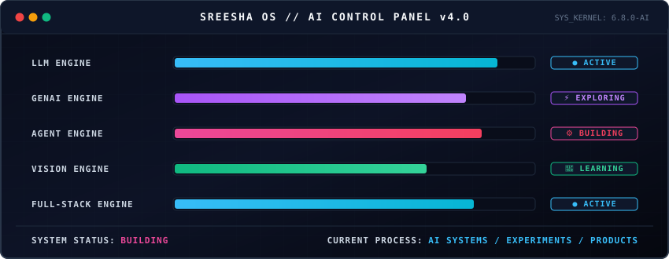
</div>

### 📡 Core Engine Telemetry

| Engine System | Execution Mode | Operational State | Focus Area |
| :--- | :--- | :--- | :--- |
| **LLM ENGINE** | Multi-Model Inference | `● ACTIVE` | Fine-Tuning, Prompt Design & Reasoning |
| **GENAI ENGINE** | Synthetic Generation | `⚡ EXPLORING` | Multimodal Systems & Audio/Text Synthesis |
| **AGENT ENGINE** | Autonomous Reasoning | `⚙️ BUILDING` | Tool-Calling, LangChain & Agent Workflows |
| **VISION ENGINE** | Spatial Kinematics | `🧠 LEARNING` | MediaPipe, OpenCV & Landmark Analysis |
| **FULL-STACK ENGINE** | Web & API Services | `● ACTIVE` | FastAPI, React, PostgreSQL & Edge AI |

---

## 🚀 PROJECT UNIVERSE

### 1. SignBridge // Accessible Vision-AI System
> Sign language video translation ➔ Structured Text ➔ Real-time Audio + Conversational AI Dialogue.

<div align="center">
  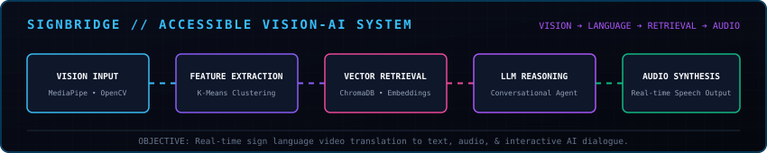
</div>

- **Core Architecture:** `MediaPipe` ➔ `OpenCV` ➔ `K-Means Clustering` ➔ `ChromaDB Vector RAG` ➔ `LLM AI Agent` ➔ `Audio Speech Synthesis`
- **Key Capabilities:** Converts continuous sign language video streams into processed text embeddings, queries ChromaDB for contextual retrieval, and passes structured output through an LLM agent for natural conversational audio output.

<br/>

### 2. FactoryOS // Smart Manufacturing IIoT Operating System
> End-to-end AI Operating System for Smart MSMEs powered by IIoT Edge AI & Digital Twins.

<div align="center">
  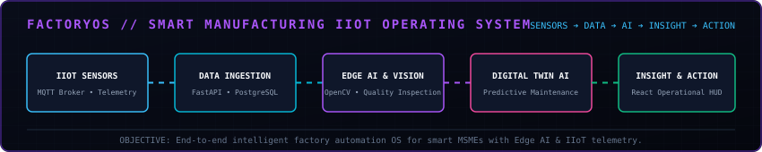
</div>

- **Core Architecture:** `IIoT Sensors` ➔ `MQTT Telemetry` ➔ `FastAPI Ingestion` ➔ `OpenCV / Edge AI` ➔ `Digital Twin Engine` ➔ `React Operational HUD`
- **Key Capabilities:** Real-time sensor telemetry ingestion over MQTT, automated visual defect detection using OpenCV Edge AI, and predictive machine failure modeling via a digital twin simulator.

<br/>

### 3. EchoHand // Intel Gesture Interaction Engine
> Contactless gesture interaction framework translating spatial motion into system intents.

<div align="center">
  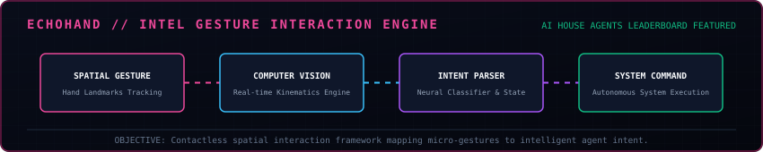
</div>

- **Core Architecture:** `Spatial Gestures` ➔ `Computer Vision Engine` ➔ `Intent Parser` ➔ `Autonomous System Commands`
- **Recognition:** Featured on the **AI House Agents Leaderboard**.
- **Key Capabilities:** Maps real-time hand kinematics to high-confidence system actions, enabling touchless UI interaction and gesture-driven AI agent commands.

---

## 💡 BUILD PHILOSOPHY

<div align="center">
  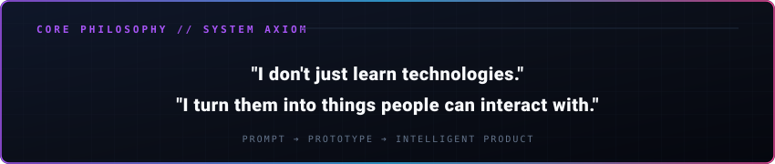
</div>

---

## ⏳ SYSTEM EVOLUTION // TRAJECTORY

<div align="center">
  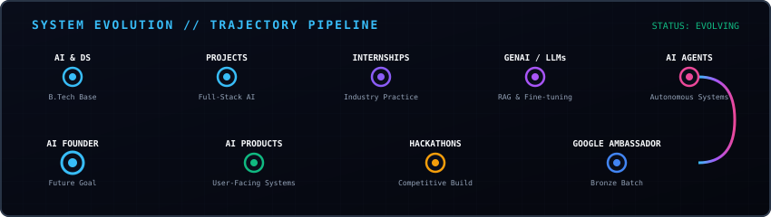
</div>

### 📜 Evolution Log

```
[ AI & DS BASE ] ➔ [ INTERNSHIPS ] ➔ [ LLM / GENAI ] ➔ [ GOOGLE AMBASSADOR ] ➔ [ AI PRODUCTS ]
```

* **Full-stack Intern** — *Gateway Software Solutions*
* **ML + Power BI Intern** — *Neural Gen AI*
* **Gen AI with LLM Intern** — *Skylena Info Tech*
* **Python Intern** — *CodeSoft*
* **AI Agent Development** — *Infosys Springboard*
* **Google Gen AI Academy 2.0** — *Google*
* **Startup School: Prompt to Prototype** — *Startup School*
* **Python for Data Science** — *NPTEL Certification*

---

## 🌐 COMMUNITY SIGNAL // MILESTONE

<div align="center">
  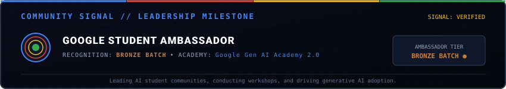
</div>

---

## 🔬 CURRENTLY EXPLORING

<div align="center">
  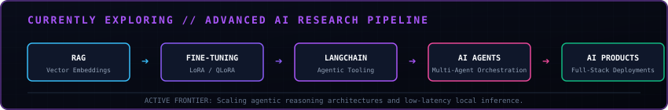
</div>

```
[ RAG ] ───➔ [ FINE-TUNING ] ───➔ [ LANGCHAIN ] ───➔ [ AI AGENTS ] ───➔ [ AI PRODUCTS ]
```

---

## 🛠️ TECH MATRIX // CAPABILITY ENGINE

<div align="center">
  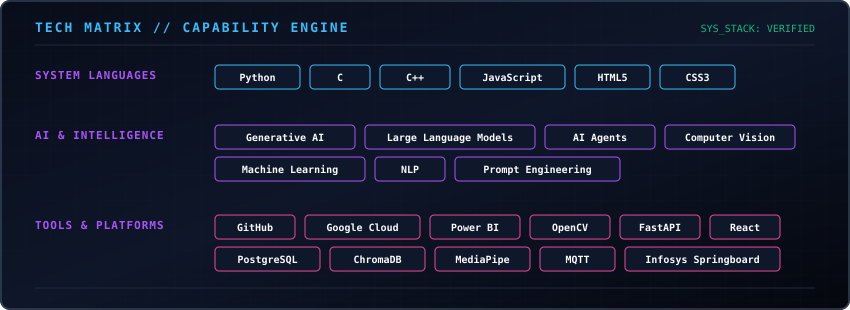
</div>

---

## 📊 ACTIVITY CORE

<div align="center">
  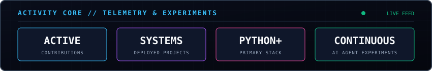
</div>

---

## ⚡ CONNECT TO THE SYSTEM

<div align="center">

  

  <br/>

  <a href="https://github.com/SreeshaNarasimhan">
    
  </a>
  &nbsp;
  <a href="https://linkedin.com/in/sreeshanarasimhan">
    
  </a>
  &nbsp;
  <a href="mailto:sreeshanarasimhan@gmail.com">
    
  </a>

  <br/><br/>

  <sub>SREESHA NARASIMHAN // AI UNIVERSE CORE • BUILT FOR INTELLECTUAL EXPLORATION</sub>

</div>
